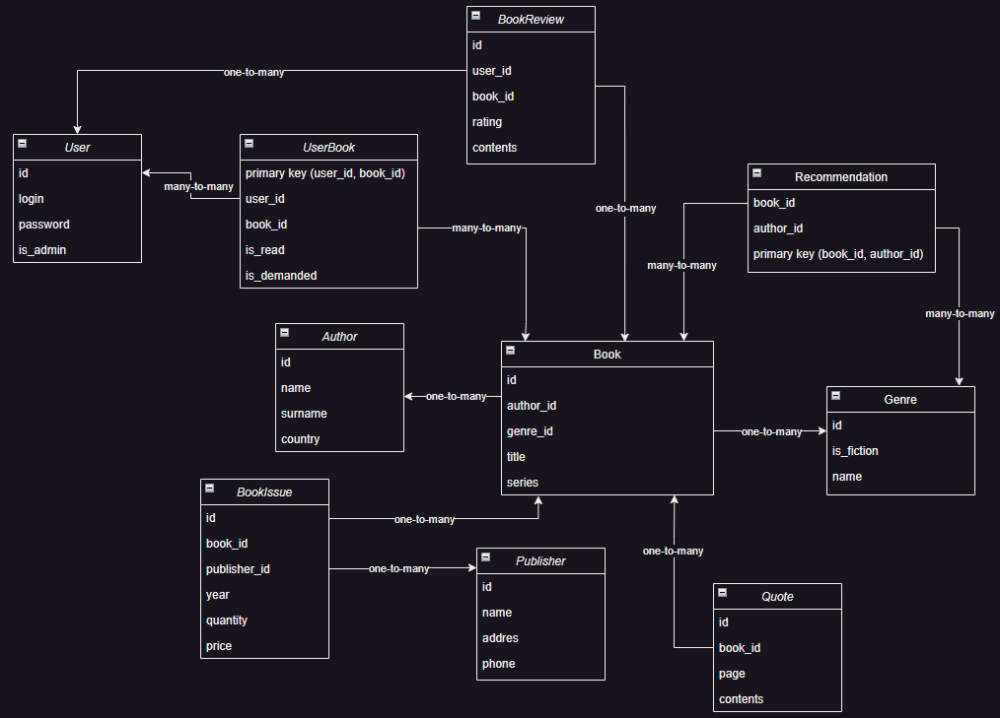

# BookControlSystem

The system is designed to manage books, their authors and other related entities.

# Student Victor Shunko, group 153504
Проект представляет собой систему для контроля книг.

# Функциональные требования

Админ
+ Управление пользователями (CRUD)
+ Управление книгами (CRUD)
+ Добавление жанров книг
+ Весь функционал пользователя

Пользователь
+ Добавление отзывов о книгах
+ Добавление цитат из книг
+ Возможность отмечать прочитанные книги и книги, которые пользователь хочет прочитать

Неавторизованный пользователь
+ Авторизация пользователя
+ Просмотр книг, изданий, жанров, цитат, рекомендаций авторов, отзывов

# Схема бд
