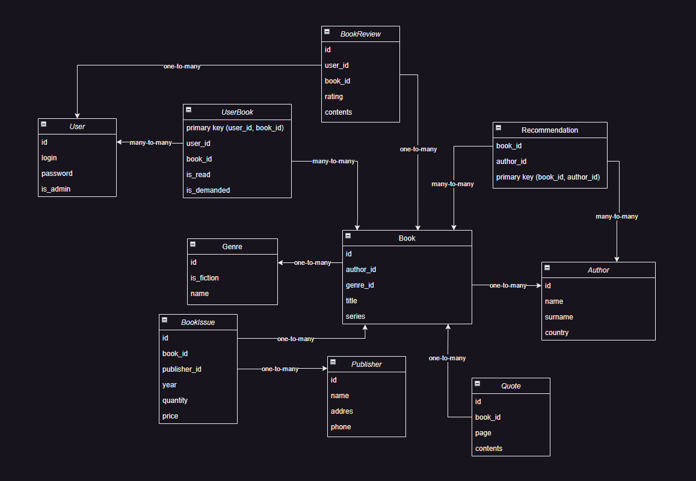

# BookControlSystem

The system is designed to manage books, their authors and other related entities.

# Student Victor Shunko, group 153504
Проект представляет собой систему для контроля книг.

# Функциональные требования

Админ
+ Управление пользователями (CRUD)
+ Управление книгами (CRUD)
+ Добавление жанров книг
+ Весь функционал пользователя

Пользователь
+ Добавление отзывов о книгах
+ Добавление цитат из книг
+ Возможность отмечать прочитанные книги и книги, которые пользователь хочет прочитать

Неавторизованный пользователь
+ Авторизация пользователя
+ Просмотр книг, изданий, жанров, цитат, рекомендаций авторов, отзывов

# Схема бд

# Book

id (PK, int) - Уникальный идентификатор книги.

title (varchar) - Название книги

series (varchar) - Серия книги.

- Связи с другими сущностями:

author_id связан с PK автора в таблице Author. (one to many)

genre_id связан с PK автора в таблице Genre. (one to many)

Эта сущность описывает книгу.

# Author

id (PK, int) - Уникальный идентификатор автора.

name (varchar) - Имя автора.

surname (varchar) - Фамилия автора.

country (varchar) - Страна автора

Эта сущность описывает автора.

# Genre

id (PK, int) - Уникальный идентификатор жанра.

name (varchar) - Название жанра.

is_fiction (boolean) - Является ли жанр художественным.

Эта сущность описывает жанр книги.

# Quote

id (PK, int) - Уникальный идентификатор цитаты.

page (int) - Страница с цитатой.

contents (varchar) - Текст цитаты.

- Связи с другими сущностями:

book_id связан с PK книги в таблице Book. (one to many)

Эта сущность описывает цитату из книги.

# Publisher

id (PK, int) - Уникальный идентификатор издательства.

name (varchar) - Название издательства.

addres (varhar) - Адрес издательства.

phone (varchar) - Телефон издательства.

Эта сущность описывает издательство.

# BookIssue

id (PK, int) - Уникальный идентификатор издания.

year (int) - Год издания.

quantity (int) - Тираж издания.

price (double) - Цена одной книги.

- Связи с другими сущностями:

book_id связан с PK книги в таблице Book. (one to many)

publisher_id связан с PK издательства в таблице Publisher. (one to many)

Эта сущность описывает издание книги.

# Recommendation

primary key (book_id, author_id) - Уникальный идентификатор рекомендации.

- Связи с другими сущностями:

book_id связан с PK книги в таблице Book. (many to many)

author_id связан с PK автора в таблице Author. (many to many)

Эта сущность описывает рекомендацию автором книги.

# User

id (PK, int) - Уникальный идентификатор пользователя.

login (varchar) - Логин пользователя.

password (varhar) - Пароль пользователя.

is_admin (boolean) - Является ли пользователь админом.

Эта сущность описывает пользователя.

# UserBook

primary key (book_id, author_id) - Уникальный идентификатор книги.

is_read (boolean) - Прочитана ли книга.

is_demanded (boolean) - Хочет ли пользователь прочитать книгу.

- Связи с другими сущностями:

user_id связан с PK пользователя в таблице User. (many to many)

author_id связан с PK автора в таблице Author. (many to many)

Эта сущность описывает книгу которую пользователь прочитал или хочет прочитать.

# BookReview

id (PK, int) - Уникальный идентификатор отзыва.

rating (int) - Рейтинг.

contents (varchar) - Текст отзыва.

- Связи с другими сущностями:

book_id связан с PK книги в таблице Book. (one to many)

user_id связан с PK издательства в таблице User. (one to many)

Эта сущность описывает отзыв.